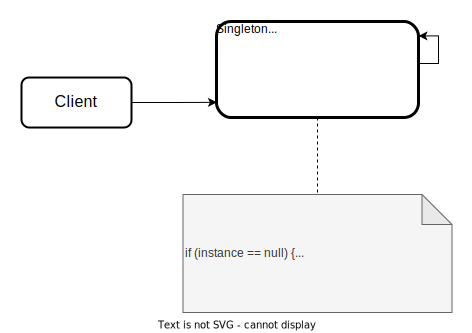

# Singleton Design Pattern

- provides a single instance of an object, while providing a global access point to this instance
- gurantees that there are no duplicates

## Solution
All the implementations of the Singleton have 2 steps in common:
- Make the default constructor private, to prevent other objects from using the `new` operator with the Singleton class
- Create a static creation method that acts as a constructor. Under the hood, this method calls the private constructor to create an object and saves it in a static field. All the following calls to this method return the cached object.

If your code has access to the Singleton class, then it's able to call the Singleton's static method. So whenever that method is called, the same object is always returned.

</img>

## Usecases:
- when you want to use the same connection to a database to make every query
- when you open SSH connection to a server to do a few tasks
- if you need to limit the access to some variable or space
- if you need to limit the number of calls to some places

## When to apply:
- we need a single, shared value of some particular type
- we need to restrict object creation of some type to a single unit along with entire program

